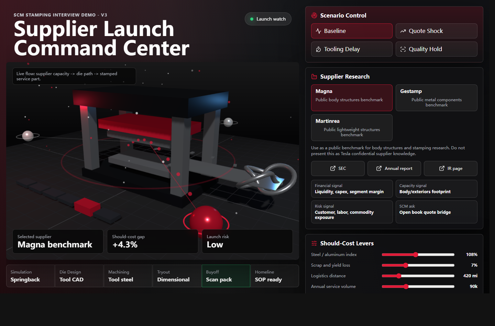

# Stamping SCM Command Center V3

An interview-ready 3D web project built for a Tesla Supply Chain Manager, Stamping conversation.

V3 is designed as a lightweight sourcing decision cockpit, not a static dashboard. It connects public supplier research, should-cost levers, ECN/timing risk, tooling bottlenecks, capacity cover, quality risk, sourcing ranking, supplier pressure questions, and exportable SCM memos.



## What The Team Could Use

- Compare stamping-capable public supplier benchmarks under the same should-cost assumptions
- Convert public filings into practical sourcing questions
- See how cost, capacity, ECN severity, and SOP timing buffer affect sourcing risk
- Generate a quick SCM memo after a supplier review
- Export a supplier scorecard CSV for follow-up analysis
- Explain launch risk visually through supplier-to-press flow, die-stage bottlenecks, and output behavior

## Why It Is More Than Excel

Excel can track dates and formulas. V3 shows the physical and causal side that a spreadsheet does not communicate well:

- Supplier-to-press flow changes with selected supplier and risk
- Press speed and output flow react to capacity, scrap, ECN severity, and scenario
- Die-stage blocks highlight bottlenecks such as simulation, machining, tryout, buyoff, or homeline
- Risk halo intensity changes with quote gap, quality, capacity, financial exposure, ECN load, and SOP buffer
- Recommendation and pressure questions update from the same model

## Public Research Scope

The supplier examples are public benchmarks, not confidential Tesla supplier claims. They are included to show how an SCM candidate would structure public research before a sourcing decision.

- Magna International: SEC EDGAR, annual report, investor relations
- Gestamp: annual information, corporate reports, sustainability reports
- Martinrea: investor relations, annual report, sustainability report

## Open Locally

Open `index.html` in a browser, or use the included server:

```bash
npm start
```

Then open:

```text
http://127.0.0.1:5178
```

## Interview Pitch

> I built a 3D Stamping SCM Command Center to show how I would bring coding and AI workflow thinking into this role. The app does not just display status; it turns supplier research, should-cost, ECN risk, capacity, tooling stages, and launch timing into a sourcing recommendation, pressure questions, and an exportable memo. My goal was to show the way I operate: structure ambiguity, connect data to action, and make cross-functional execution faster.

## Files

- `index.html` - app shell
- `styles.css` - professional dark manufacturing UI
- `app.js` - 3D simulation, supplier research, should-cost model, ranking, memo, and export logic
- `server.js` - zero-dependency local server
- `.github/workflows/pages.yml` - GitHub Pages deployment workflow
- `INTERVIEW_PITCH.md` - short story and demo flow for the interview

## Note

This is a portfolio demo for interview preparation. It is not affiliated with or endorsed by Tesla.
